

# 🚀 SmartBids — Inteligencia para Ofertar

**Plataforma SaaS para el mercado de compras públicas (Mercado Público / ChileCompra)**  
*Analítica de datos masivos y Machine Learning predictivo para MiPyMEs.*

[📖 Consultar Guía Completa de Instalación y Comandos Git (readme.txt)](./readme.txt)

---

## 📌 1. Plataforma y Propuesta de Valor

SmartBids transforma millones de datos abiertos de Mercado Público en oportunidades estratégicas para proveedores y MiPyMEs, automatizando el monitoreo y estimando la probabilidad de adjudicación mediante modelos de Machine Learning.

### Portada y Estimación de Éxito
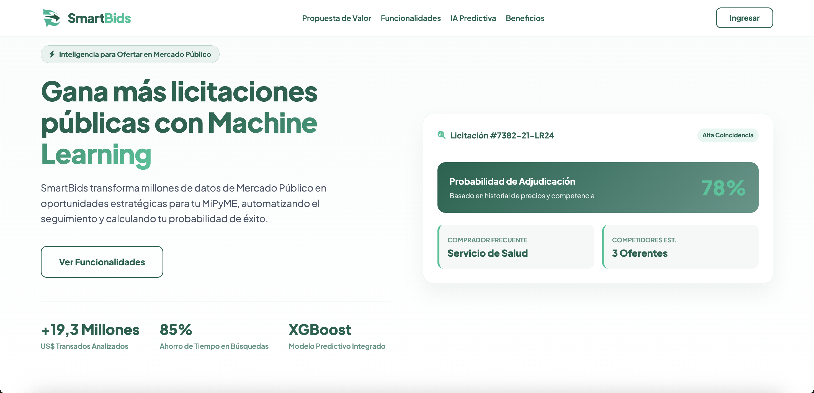
*Vista principal: Propuesta de valor, métricas de transacciones analizadas (+19,3 M USD) y tarjeta interactiva de adjudicación con modelo predictivo XGBoost.*

| Propuesta de Valor MiPyME | Búsqueda Avanzada y Perfilamiento |
| :---: | :---: |
| 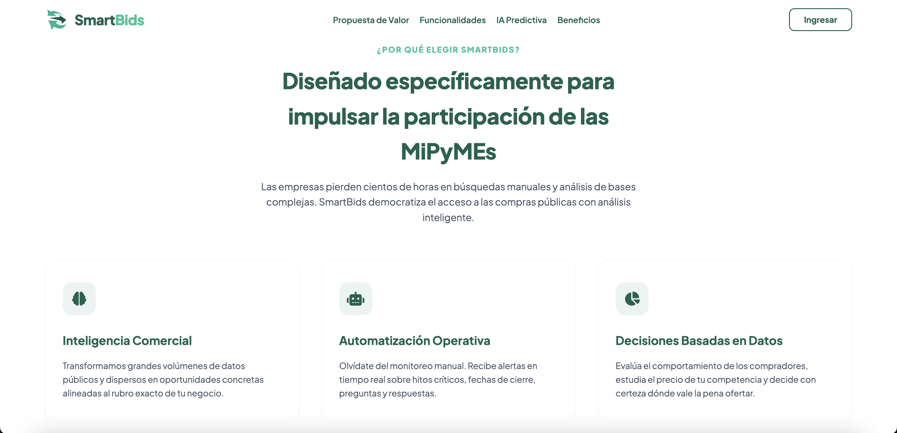 | 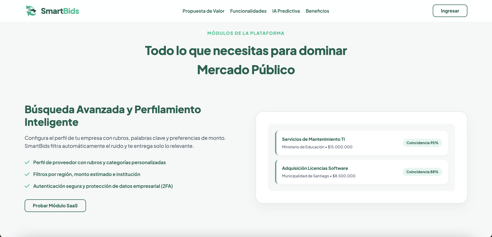 |
| *Inteligencia comercial, automatización de hitos y toma de decisiones basadas en datos.* | *Filtrado inteligente por rubro, catálogo de productos y concordancia porcentual.* |

| Modelos Predictivos (Scikit-Learn / XGBoost) | Beneficios Tangibles de Mercado |
| :---: | :---: |
| 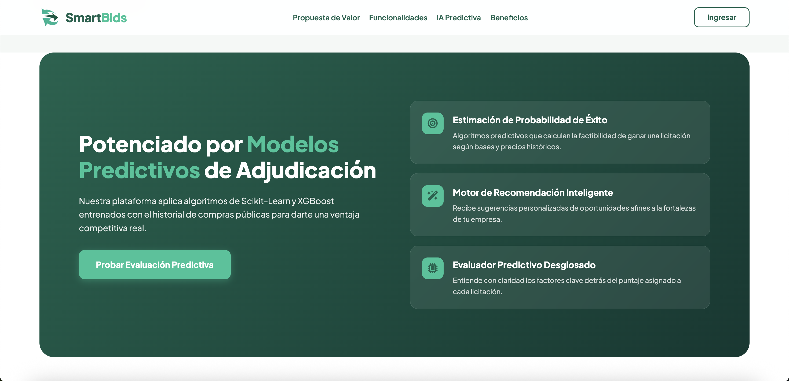 | 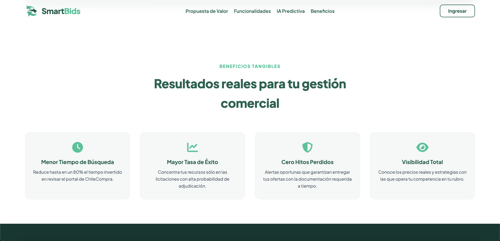 |
| *Algoritmos entrenados con histórico de compras públicas para cálculo de factibilidad.* | *Reducción de hasta un 80% en tiempo de búsqueda y seguimiento de hitos críticos.* |

---

## 📊 2. Analítica de Mercado y Seguimiento de Licitaciones

| Dashboard Analítico de Mercado | Seguimiento Dinámico de Oportunidades |
| :---: | :---: |
| 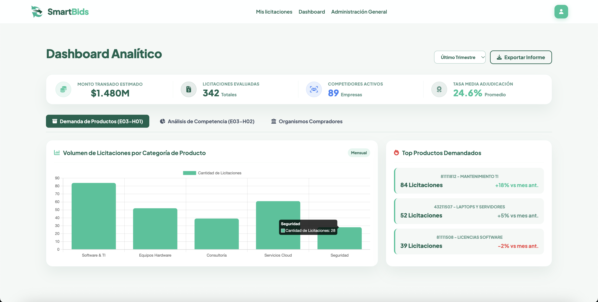 | 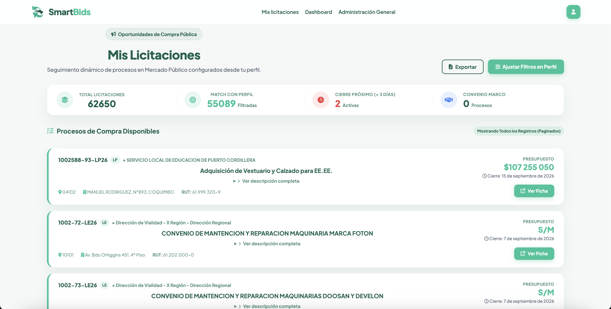 |
| *Métricas del último trimestre: montos transados, volumen mensual por categoría y productos más demandados.* | *Listado de procesos públicos filtrados automáticamente en base al perfil del proveedor.* |

---

## 🔔 3. Mensajería y Alertas Globales en Tiempo Real

El sistema cuenta con un motor de notificaciones en vivo que sincroniza advertencias operativas y confirmaciones de carga directamente en la cabecera de la interfaz.

| Demostración en Tiempo Real | Consola de Administración de Alertas |
| :---: | :---: |
| 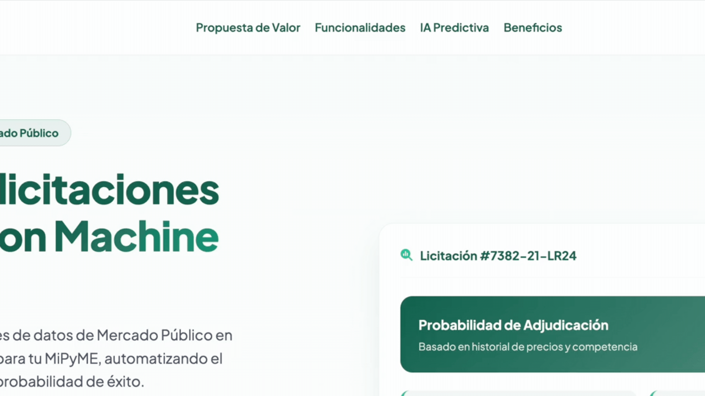 | %201.25.59%20p.m..jpg) |
| *Notificaciones superiores animadas con barra de tiempo regresiva.* | *Gestión de estados, prioridad (éxito/alerta) y redacción de anuncios.* |

---

## 🔐 4. Autenticación, Seguridad y Doble Factor (2FA)

La plataforma integra validación de dos pasos para resguardar la identidad corporativa y cumplir con auditorías de seguridad.

| Iniciar Sesión en SmartBids | Registro de Nuevas Cuentas |
| :---: | :---: |
| 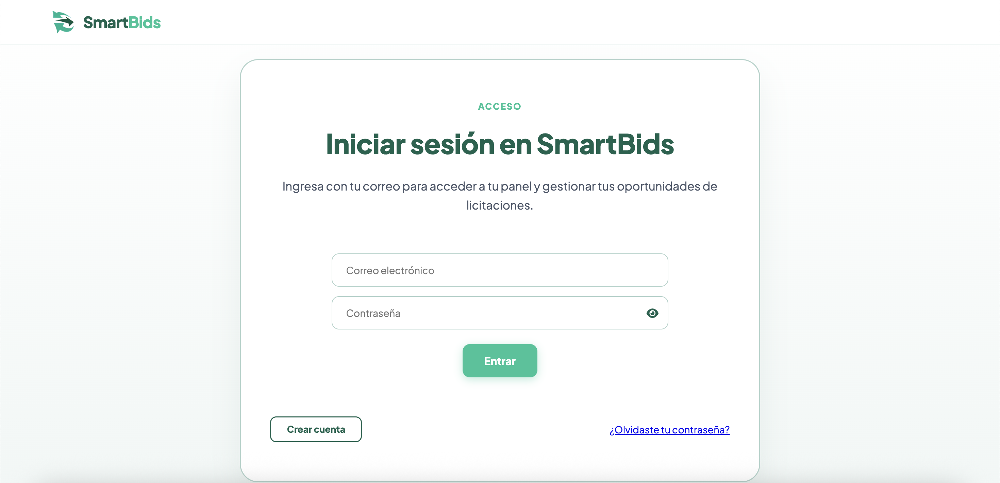 | 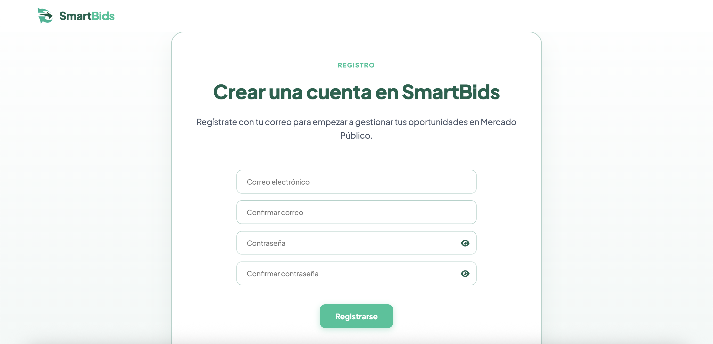 |
| *Acceso seguro con validación de credenciales.* | *Formulario de inscripción corporativa con confirmación de clave.* |

| Verificación de Seguridad OTP (6 dígitos) | Correo Transaccional de Autenticación |
| :---: | :---: |
| 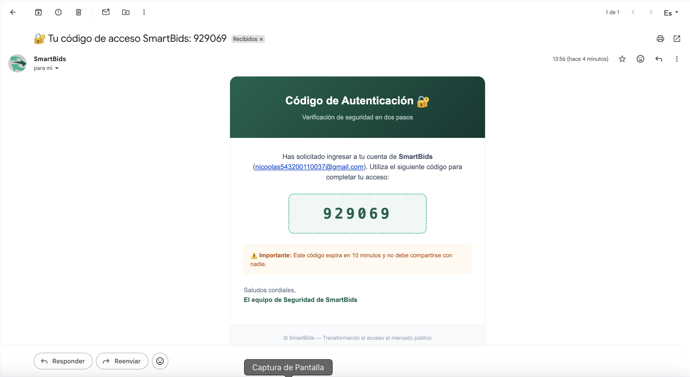 | 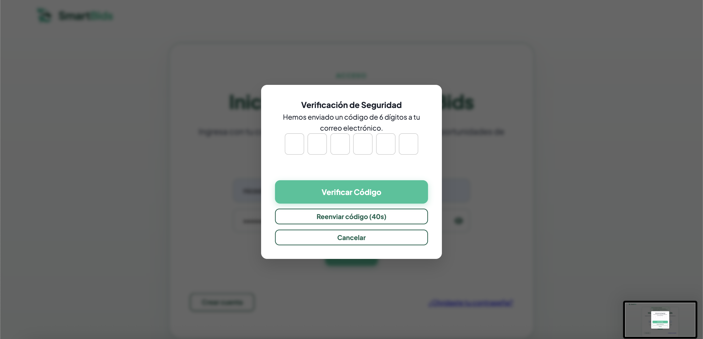 |
| *Modal flotante de doble factor para validar inicio de sesión.* | *Código de seguridad enviado por email con caducidad de 10 minutos.* |

---

## 👤 5. Administración del Suscriptor, Empresa y Filtros

| Información del Suscriptor | Datos de la Empresa (Tributaria) |
| :---: | :---: |
| 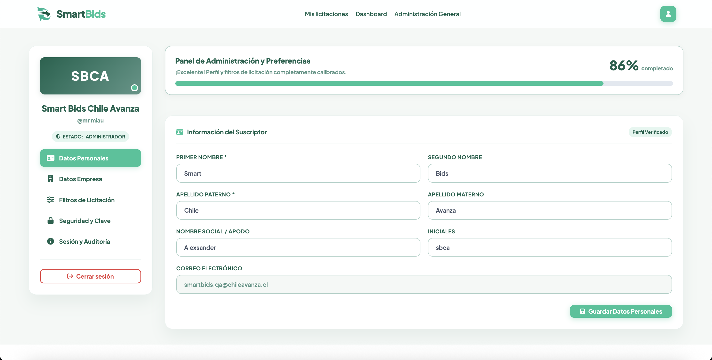 | 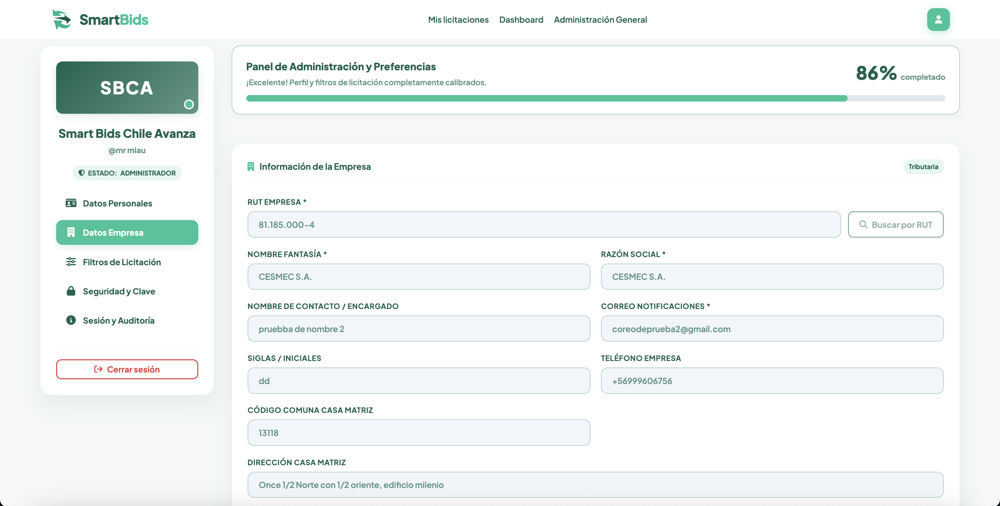 |
| *Gestión de nombres, apodo, correo y porcentaje de calibración.* | *Razón social, RUT, dirección comercial y canales de notificación.* |

| Filtros de Mercado (Catálogo ONU) | Seguridad y Cambio de Clave |
| :---: | :---: |
| 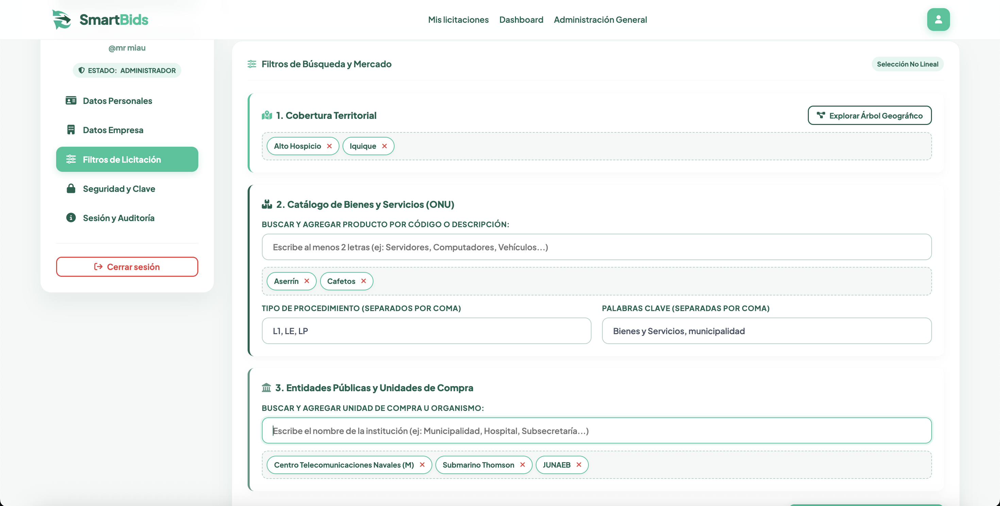 | 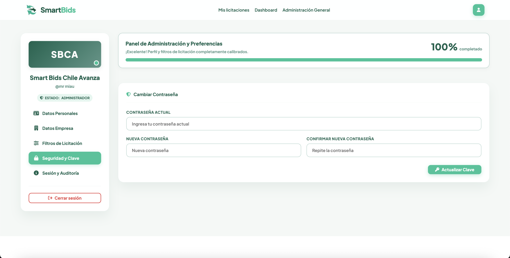 |
| *Filtro por territorio, códigos ONU y organismos compradores.* | *Módulo de actualización y robustecimiento de contraseñas.* |

### Calibración Activa del Perfil
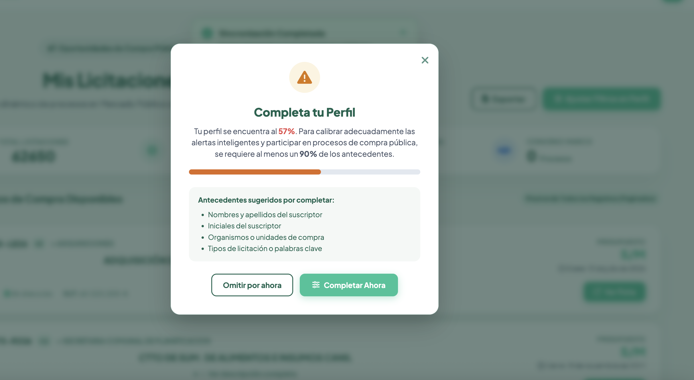
*Asistente inteligente que orienta al usuario para alcanzar el 90% de completitud necesario para calibrar el algoritmo.*

---

## 🛡️ 6. Marco Normativo y Privacidad

| Términos del Servicio | Política de Privacidad (Ley N° 19.628) | Seguridad Empresarial y Cifrado |
| :---: | :---: | :---: |
| 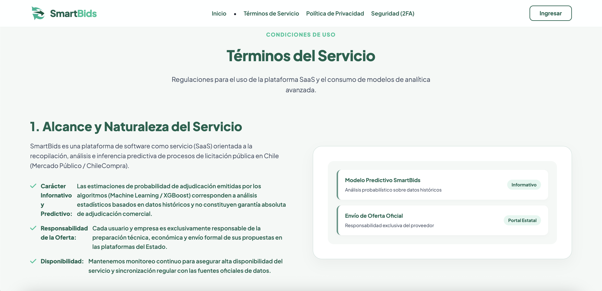 | 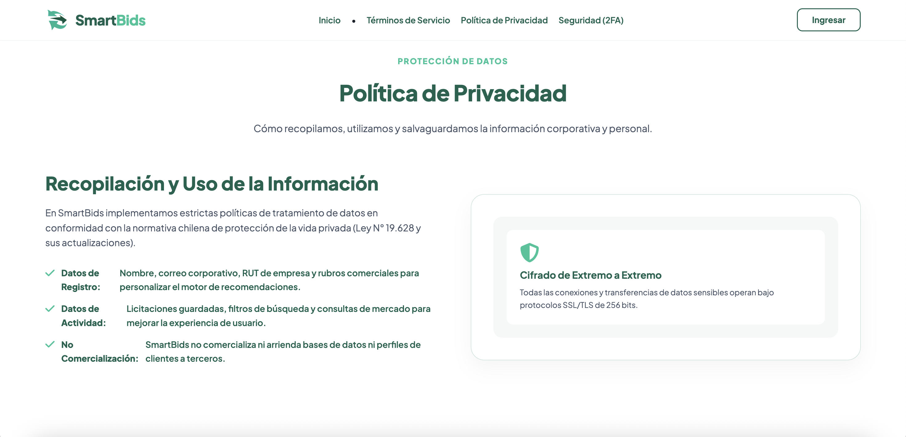 | 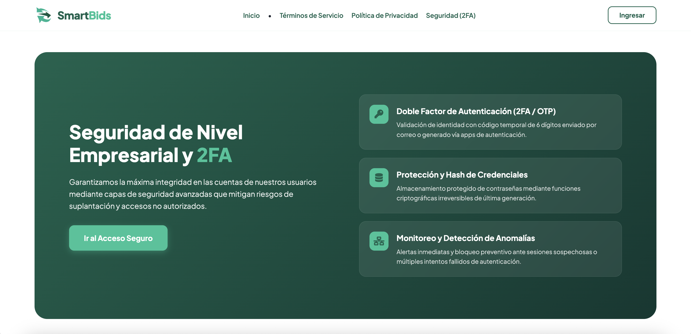 |
| *Alcance informativo y predictivo de los modelos.* | *Cifrado de extremo a extremo SSL/TLS de 256 bits.* | *Hash seguro de claves y monitoreo de anomalías.* |

---

## 🛠️ Stack Tecnológico

* **Backend:** Python 3.10+, Django, WhiteNoise, Gunicorn[cite: 7].
* **Inteligencia Artificial & Datos:** Scikit-Learn, XGBoost, Pandas[cite: 7, 10].
* **Frontend:** HTML5, CSS3, JavaScript modular (ES6+)[cite: 7, 31].
* **Autenticación & Real-time:** Firebase Authentication (2FA/OTP), Cloud Firestore[cite: 7, 13, 23].
* **Base de Datos:** PostgreSQL[cite: 7].

---

## ⚙️ Instalación y Configuración del Proyecto

Todos los comandos para levantar el entorno virtual en **Ubuntu/Debian**, **macOS** y **Windows**, así como las instrucciones de sincronización de ramas Git, se conservan de forma íntegra en el archivo del repositorio:

👉 **[Ver Guía Paso a Paso de Instalación (readme.txt)](./readme.txt)**[cite: 7]
